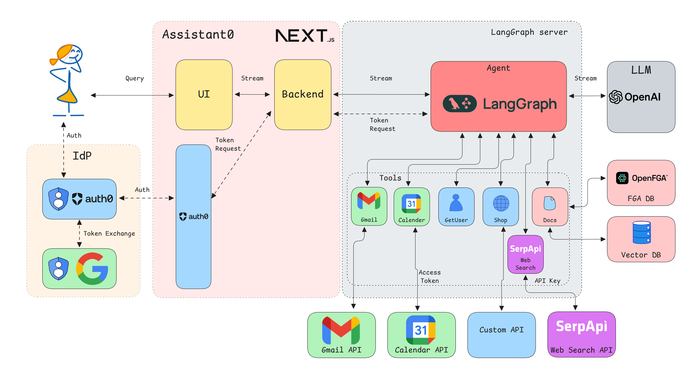

# HealthPilot: Secure AI Health Agent

A production-ready AI health agent that coordinates patient care across MyChart (Epic), CVS Pharmacy, and Cigna Insurance using natural language — with enterprise-grade security backed by Auth0 for AI Agents.



## About HealthPilot

Healthcare is the highest-stakes domain for AI agents. A coding assistant that hallucinates is annoying. An AI health agent that leaks your lab results to the wrong person, requests a prescription refill without your knowledge, or shares your cardiac records with an unauthorized provider is a HIPAA violation, a safety incident, and a trust catastrophe.

HealthPilot demonstrates what responsible AI healthcare actually looks like. Every Auth0 for AI Agents feature is exercised with genuine, high-stakes justification:

- **Token Vault** — Agent accesses Epic, CVS, Cigna via short-lived OAuth tokens, never touching credentials
- **CIBA** — Patient must explicitly approve every prescription refill and appointment booking
- **FGA** — Document-level access control enforces permissions at retrieval time

## Security Architecture

| Layer           | Protection                                                      |
| --------------- | --------------------------------------------------------------- |
| **Credentials** | Stored in Auth0 Token Vault, never in agent code                |
| **Actions**     | CIBA requires phone-based approval for consequential operations |
| **Data Access** | FGA filters documents before they reach the LLM                 |

This template uses:

- [LangGraph.js](https://langchain-ai.github.io/langgraphjs/) for agentic workflows
- [Auth0 for AI Agents](https://auth0.com/ai) (Token Vault, CIBA, FGA)
- [Auth0 Next.js SDK](https://github.com/auth0/nextjs-auth0) for authentication
- [Next.js 15](https://nextjs.org/) with App Router

## Features

### Healthcare Tools

- **MyChart** — Medical records, lab results, appointments
- **CVS Pharmacy** — Prescriptions, refills, pharmacy locations
- **Cigna Insurance** — Coverage details, claims, eligibility
- **Health Documents** — FGA-filtered document retrieval

### Security Features

- Token Vault connections for credential-less API access
- CIBA async authorization for prescription refills and appointments
- FGA-enabled RAG with retrieval-layer filtering

## 🚀 Getting Started

Clone the repository:

```bash
git clone https://github.com/auth0-samples/auth0-assistant0.git
cd auth0-assistant0/ts-langchain
```

Set up environment variables. Copy `.env.example` to `.env.local` and add:

- **Auth0** — Domain, client ID, client secret for Token Vault
- **OpenAI** — API key for GPT-4o-mini
- **Auth0 FGA** — Store ID, client ID, client secret, API URL

See the [Prerequisites](https://auth0.com/ai/docs/get-started/call-others-apis-on-users-behalf) for setting up Auth0.

Install dependencies and start services:

```bash
npm install
# Start PostgreSQL
docker compose up -d
# Create database schema
npm run db:migrate
# Initialize FGA store
npm run fga:init
```

Run the development server:

```bash
npm run all:dev
```

Open [http://localhost:3000](http://localhost:3000) to try HealthPilot.

## Example Queries

- "Show me my prescriptions"
- "Refill my Lisinopril" (triggers CIBA)
- "Book a cardiology appointment" (triggers CIBA)
- "What's my deductible?"
- "Show my recent lab results"

## Documentation

- [Auth0 for AI Agents](https://auth0.com/ai/docs/)
- [Token Vault](https://auth0.com/features/token-vault)
- [CIBA / Async Authorization](https://auth0.com/ai/docs/intro/asynchronous-authorization)
- [Auth0 FGA](https://auth0.com/fine-grained-authorization)
- [LangGraph.js](https://langchain-ai.github.io/langgraphjs/)

## License

MIT License — see the [LICENSE](LICENSE) file for details.

## Author

Built with Auth0 for AI Agents, LangGraph.js, and Next.js.
